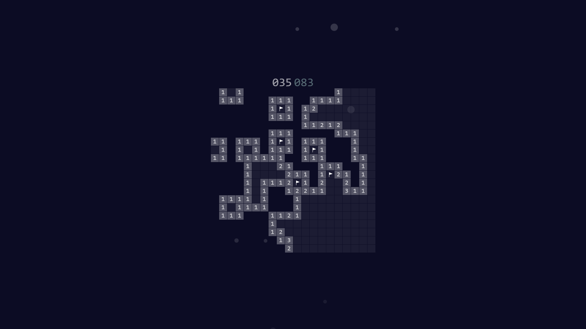

# Minesweeper

JQuery interpretation of the [Minesweeper](https://en.wikipedia.org/wiki/Minesweeper_(video_game)) game. The goal of the game is to locate all the mines on the play field -- marking each with a flag -- based on clues revealed by clicking on the gameboard; if a square containing a mine is revealed, the player loses the game. If a player clicks on a square where no mines are adjacent, the square becomes blank, and all adjacent squares also become blank; the same effect can be had by two-button clicking on a clue where all adjacent mines are marked. The project's aims were 1. a straightforward implementation, and 2. apply aesthetics that are unusual for the genre while adding quality to the gameplay.

## Screenshot

## License

See the [LICENSE](./LICENSE.md) file for license rights and limitations.

